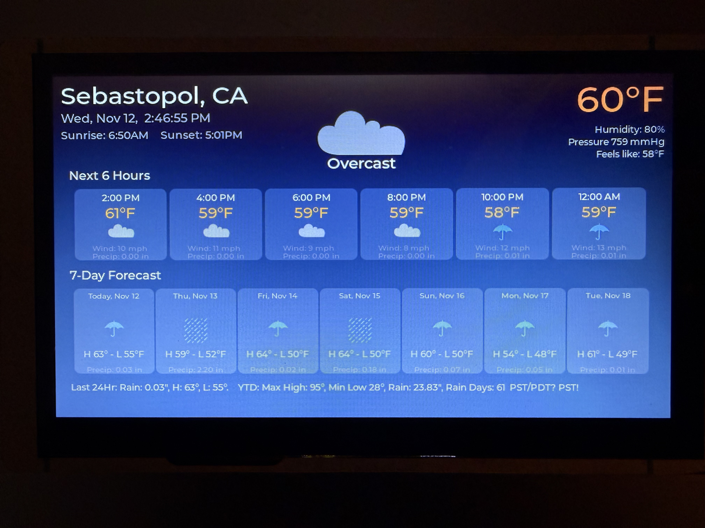

# ELECROW 7" ESP32 Weather Clock

A weather clock display for the **ELECROW CrowPanel 7-inch HMI ESP32 Display (DIS08070H)** showing:



- NTP-synced time and date  
- Current weather conditions from Open-Meteo API  
- Temperature in Fahrenheit  
- Touch-enabled 800×480 RGB display  

---

## Hardware Requirements

- **ELECROW CrowPanel 7" Display** (DIS08070H)  
  - ESP32-S3-WROOM-1-N4R8 module  
  - 800×480 RGB TFT LCD  
  - Capacitive touch screen  
  - Display drivers: EK9716BD3 & EK73002ACGB  

---

## Software Requirements

### Arduino IDE Setup

1. **Install ESP32 Board Package**
   - Open **Arduino IDE → Tools → Board → Boards Manager**
   - Search for **"esp32"**
   - Install **“esp32 by Espressif Systems” version 2.0.15**  
     ⚠️ Must use **2.0.15**, not 2.0.17 or newer  
   - Restart Arduino IDE after installation

2. **Board Configuration**

   Set the following under **Tools**:

   | Setting | Value |
   |----------|--------|
   | **Board** | ESP32S3 Dev Module |
   | **USB CDC On Boot** | Disabled |
   | **PSRAM** | OPI PSRAM ⚠️ *(Critical setting)* |
   | **Partition Scheme** | Huge APP (3MB No OTA/1MB SPIFFS) |
   | **Upload Speed** | 115200 |
   | **Flash Mode** | QIO |
   | **Flash Size** | 4MB (or default) |

---

## Required Libraries

Install these via **Sketch → Include Library → Manage Libraries**:

| Library | Author | Version | Notes |
|----------|---------|---------|--------|
| LVGL | kisvegabor | 8.3.11 | Must use 8.3.x series |
| LovyanGFX | lovyan03 | 1.1.8 or 1.2.7 | Required for RGB display |
| ArduinoJson | Benoit Blanchon | Latest | For Open-Meteo API parsing |

---

## LVGL Configuration

1. Locate the template file:  
   `~/Documents/Arduino/libraries/lvgl/lv_conf_template.h`

2. Copy it to the libraries folder:  
   ```bash
   cp ~/Documents/Arduino/libraries/lvgl/lv_conf_template.h ~/Documents/Arduino/libraries/lv_conf.h
   ```

3. Edit `lv_conf.h`:  
   - **Line 15** → Change `#if 0` to `#if 1`  
   - **Font section (Lines 606–626)** → Enable:
     ```c
     #define LV_FONT_MONTSERRAT_12 1
     #define LV_FONT_MONTSERRAT_14 1
     #define LV_FONT_MONTSERRAT_16 1
     #define LV_FONT_MONTSERRAT_20 1
     #define LV_FONT_MONTSERRAT_24 1
     #define LV_FONT_MONTSERRAT_48 1
     ```

4. Restart Arduino IDE.

---

## Sketch Configuration

Edit the following values in your `.ino` sketch:

```cpp
// WiFi credentials
const char* ssid = "your_wifi_name";
const char* password = "your_wifi_password";

// Timezone
const long gmtOffset_sec = -8 * 3600;  // Adjust for your timezone
const int daylightOffset_sec = 3600;   // DST offset

// Location (latitude, longitude)
const float latitude = 38.3986;
const float longitude = -122.8790;

// Weather update interval (milliseconds)
const unsigned long weatherUpdateInterval = 15 * 60 * 1000;  // 15 minutes
```

---


## Serial Monitor

- **Baud Rate**: 115200  
- Shows WiFi status, NTP sync, and weather updates.  
- Ensure **USB CDC On Boot** is **Disabled** if no output appears.

---

## Features

### Display Layout

- **Time**: Large HH:MM:SS (48pt white font)  
- **Date**: Full date (24pt gray)  
- **Temperature**: Current temp (48pt cyan, °F)  
- **Weather Condition**: Description (20pt white)  
- **Status**: Last update time (gray, bottom of screen)

### Functionality

- NTP time sync from `pool.ntp.org`  
- Weather updates every 15 minutes  
- Uses free Open-Meteo API (no key required)  
- WiFi auto-connect at startup  

---

## Technical Details

### Display

| Parameter | Value |
|------------|--------|
| Resolution | 800×480 |
| Interface | Parallel RGB666 |
| Backlight | GPIO 2 (PWM controlled) |
| Power Control | GPIO 38 |

### Pin Configuration

- 16 data pins (RGB666)  
- HSYNC, VSYNC, PCLK, H-Enable  
- Refer to source code for exact mappings.

### Memory Usage

- LVGL Buffer: ~25KB  
- Sketch Size: ~1.4MB (≈45% of Huge APP partition)  
- RAM: ~120KB (≈36% of available)

---

## Troubleshooting

### Blank Display (Backlight On)

**Causes:**
- Wrong ESP32 core version (use 2.0.15 only)  
- PSRAM not set to **OPI PSRAM**  
- Wrong board selection  

✅ **Fix:** Check all Board Configuration settings.

### Common Compilation Errors

| Error | Cause / Solution |
|-------|------------------|
| `'Wire' was not declared` | Comment out `Wire.begin(19, 20);` |
| `'GPIO_NUM_47/48' not declared` | ESP32 core version mismatch |
| `Font not found` | Missing or unedited `lv_conf.h` |

### Serial Monitor Issues

- Ensure USB CDC On Boot = **Disabled**  
- Reopen Serial Monitor after upload  
- Confirm baud = 115200  

### Weather Not Updating

- Verify WiFi credentials  
- Ensure valid latitude/longitude  
- API: `api.open-meteo.com` must be reachable  
- Serial Monitor will show **“Weather updated”** on success

---

## API Information

- **Source:** [Open-Meteo](https://open-meteo.com/)  
- **Free / No API Key**  
- **Generous rate limits**  
- **Default update interval:** 15 minutes  

---

## Credits

- **Hardware:** ELECROW CrowPanel 7" Display  
- **Libraries:** LVGL, LovyanGFX, ArduinoJson  
- **Weather API:** Open-Meteo  

---

## Support

For hardware issues:  
- [ELECROW Wiki](https://www.elecrow.com/wiki/esp32-display-702727-intelligent-touch-screen-wi-fi26ble-800480-hmi-display.html)  
- [ELECROW Support](https://www.elecrow.com/contacts)  

For software issues:  
- Review Serial Monitor logs  
- Check LVGL and board configuration  
- Revisit **Troubleshooting** section above  
